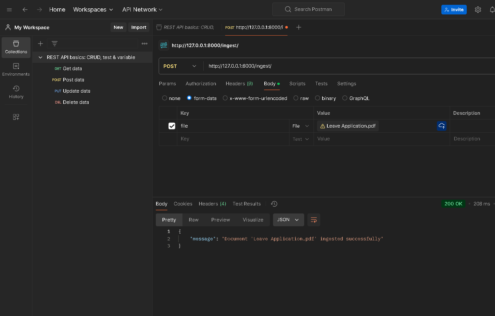
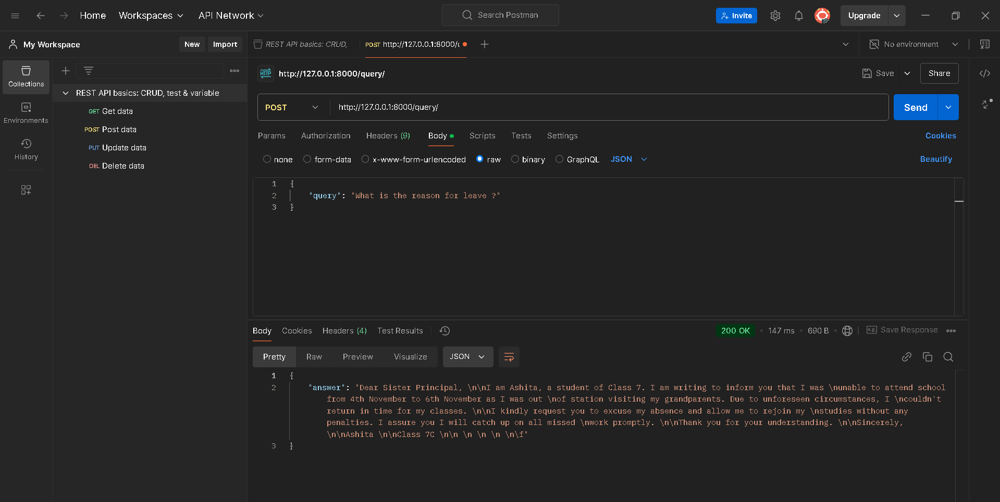

# FastAPI Document Ingestion and Querying API

This FastAPI application provides two primary functionalities: ingesting documents and querying them based on user input. It uses ChromaDB for document embedding storage and retrieval, and `sentence-transformers/all-MiniLM-L6-v2` from Hugging Face for generating embeddings.

## Prerequisites

Before running the application, ensure you have the following installed:

- Python 3.7+
- FastAPI
- Uvicorn
- ChromaDB
- Sentence-Transformers
- pdfminer.six
- python-docx

To install the required dependencies, use the following command:

```bash
pip install -r requirements.txt

```

## API Endpoints
### 1. Ingest Document
POST /ingest/

This endpoint allows you to upload a document (PDF, DOCX, or TXT) and process it by extracting text and storing it in ChromaDB for future querying.

Request Body
The request should contain a multipart/form-data body with a file.

Example using Postman or CURL:

```bash
POST http://127.0.0.1:8000/ingest/
Content-Type: multipart/form-data

{
  "file": <your file>
}

```
<p align="center">
  
</p>

### Response
A success message indicating that the document has been ingested and stored:


```bash
{
  "message": "Document 'example.pdf' ingested successfully"
}
```

### Error Response
If something goes wrong, the server will return an error message:

```bash
{
  "detail": "Failed to ingest document: <error details>"
}
```

## 2. Query Document
POST /query/

This endpoint allows you to query the documents based on a text query. It uses the embeddings stored in ChromaDB to find the most relevant documents and return the content.

Request Body
Example request body in JSON format:

```bash
{
  "query": "What is the absence request letter format?"
}
```

<p align="center">
  
</p>

### Response
The response will return the content of the most relevant documents based on your query.

Example response:

```bash
{
  "answer": "Dear Sister Principal, \n\nI am Ashita, a student of Class 7..."
}
```

### Error Response
If there is an error while querying, the response will contain an error message:

```bash
{
  "detail": "Query failed: <error details>"
}
```


